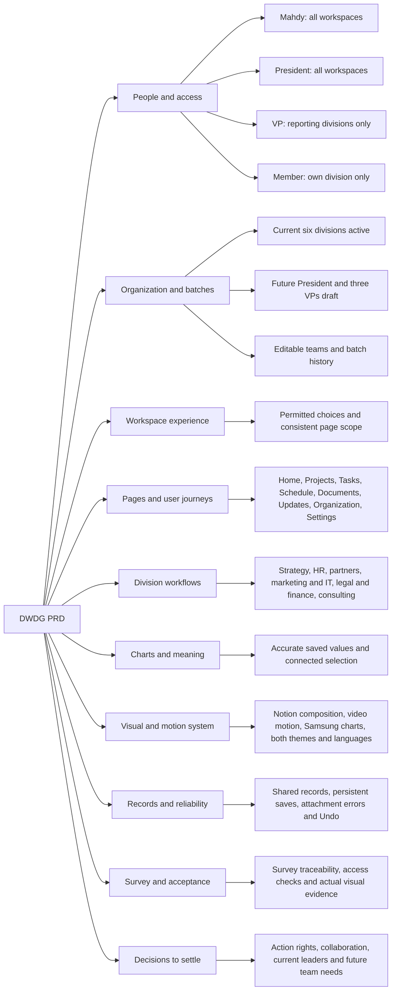

# DWDG Workspace PRD — mind map and access draft

Status: planning draft, 3 October 2026 (Asia/Jakarta). No application or account changes are made by this document. It does not yet replace the active Experience Specification v1.1 or the existing roadmap.

Purpose: agree on one coherent product structure before implementing another UI revision. The latest user decisions below take precedence over earlier proposals for unrestricted workspace switching.

## Product mind map

The original summary map below is now a horizontal overview. The expanded editable planning map contains 213 nodes with node notes, decision status, parent editing, branch deletion/restoration, and JSON/PRD export. Its source is `C:\Users\muhma\.codex\visualizations\2026\09\26\01a0dd42-4430-7711-b682-79c4fcbb2a44\dwdg-editable-prd-map.html`. Exported JSON captures user revisions; the earlier prose below remains a baseline, not an automatic reflection of later map edits.



## Confirmed decisions

- Mahdy is the intended administrator in the plan. A real login must later be bound to a verified account identifier; the displayed name alone is not an authentication rule.
- President access covers every active workspace in the organization.
- Each VP may switch only among the divisions and subteams reporting to that VP.
- An ordinary member sees only their assigned division workspace.
- The current six divisions remain active. The future President/three-VP structure remains a draft.
- Project Delivery is the provisional Consulting team name and can be renamed later.
- Expert Network is planned for two batches ahead. Its reporting relationship is undecided.
- Continue planning before modifying the web app. Preserve its working engines, records, and local storage.

## Proposed permissions contract

Workspace visibility and workspace switching are separate from authority to change roles or edit records.

| Role | Visible workspace scope | Navigation | Organization and access administration |
|---|---|---|---|
| Mahdy — Admin | All active workspaces in the organization | All DWDG overview and every workspace | Proposed: manage organization, memberships, roles, and batch activation |
| President | All active workspaces in the organization | All DWDG overview and every workspace | No administrator powers automatically granted by the President title |
| VP | Assigned reporting divisions and their subteams | Portfolio overview of that scope; switch within that scope | No authority to elevate their own access |
| Member | Assigned division workspace | Open that workspace directly; no cross-division switcher | No role or organization changes |

The administrative capabilities above are proposed defaults. Leadership editing, financial approval, legal review, and destructive actions must receive explicit action-level rules in the full PRD; seeing a workspace does not imply permission for every action in it.

## Access must be consistent everywhere

- Compute the permitted workspace set once from the current batch's roles and reporting assignments.
- Apply it to navigation, search, lists, direct record links, inspectors, charts, reminders, attachments, reports, print views, and exports.
- Members must not see other divisions' records, titles, counts, or suggestions through secondary UI paths.
- Unauthorized direct links display an access-denied state without revealing the record, with a route back to the permitted workspace.
- Missing or inactive membership produces a clear access-assignment state; never silently grant all workspaces.
- Assignment to a task does not automatically grant a member access to another division workspace. Cross-division work needs an explicit policy before implementation.
- A membership or role change refreshes the permitted scope. A draft from a workspace whose access was revoked cannot be saved into that workspace.
- Organization access remains bounded to the same organization. Supporting other businesses must not mean sharing their records.

## Workspace behavior

The workspace identity is a context selector, not a link to Organization. Admin and President see the organization overview and all active workspaces. A VP sees only their reporting scope. A member sees the identity of their assigned workspace, without an invitation to switch elsewhere.

Remove the separate hardcoded division list. Within an accessible workspace, show a consistent shell: Home, Projects, My Tasks, Schedule, Documents, Updates, and configured division tools. Settings remains an explicit destination. Organization administration is an explicit action available according to the permissions contract.

Personal tasks and notifications cover only the signed-in user's permitted scope. Admin, President, and VP may filter between their permitted portfolio and the selected workspace. Members remain scoped to their division. Existing drafts, selected tabs, and navigation history need defined preservation behavior when switching workspaces.

## Organization and batch configuration

Keep team identity, reporting relationships, workspace identity, and enabled workflow tools separate. Names and hierarchy must not be fixed in navigation, forms, filters, or validation.

Current active workspaces:

1. Strategy & Growth
2. Human Resource
3. External Engagement
4. Marketing, Communication & IT
5. Legal & Finance
6. Consulting

Future draft:

```text
President
├── VP External
│   ├── MarCom & IT
│   └── External Engagement
│       ├── Client
│       └── Partnership
├── VP Internal
│   ├── HR
│   ├── S&G
│   ├── Legal
│   └── Finance
└── VP Consulting
    ├── Project Delivery [provisional]
    ├── Knowledge
    └── Training

Expert Network [two batches ahead; reporting relationship undecided]
```

The three-VP draft does not imply those roles are already assigned in the current batch. Current leadership scope must be explicitly configured.

Renaming and reparenting teams preserve their stable identity and records. Split/merge operations preview record destinations and unresolved assignments. Activating a batch requires an explicit mapping of members, leaders, workspaces, and records. Previous batch relationships remain available as history. Ordinary navigation excludes planned teams until activation.

## Shared records and division tools

- Shared work: projects, tasks, owners, deadlines, dependencies, milestones, blockers, evidence, decisions, documents, meeting notes, reminders, and reports.
- Shared record views: list, board, timeline, calendar, inspectors, and chart drill-downs use the same records and access scope.
- Strategy: initiatives, decisions, and dependencies.
- HR: recruitment, onboarding, assignments, and development.
- External Engagement: partners, clients, follow-ups, and interaction notes.
- Marketing, Communication & IT: campaigns, publishing, deliverables, assets, and IT work.
- Legal & Finance: legal requests, revisions, signature-status records, finance requests, budgets, and locally recorded approvals/payments.
- Consulting: delivery stages, PL/PM assignments, readiness checklists, milestones, and reviews.
- Future Knowledge and Training teams can use shared projects, documents, tasks, and meetings first. Their specialized requirements remain to be defined; do not invent workflow stages.

## Visual and interaction direction

Clean Notion-like composition guides everyday working pages: aligned records, readable type, consistent spacing, restrained separators, and few competing containers. The supplied WhatsApp video guides compact floating composers, in-place expansion, participant insertion, continuous time selection, and inline conflict feedback. Its supplied stills guide selected dimensional date and action controls. Earlier CRM/task references and useful Samsung chart patterns remain active.

Preserve English/Indonesian and light/dark parity. Do not automatically translate user-entered content. Use shared typography, spacing, material, popup-placement, and motion rules rather than page-specific overrides. Provide reduced-motion and solid-surface alternatives.

Chart marks reflect saved records with clear units and honest missing-history states. Meeting availability reflects recorded meetings, with unknown availability labeled explicitly. No invented completion dates, organization health scores, or external-calendar checks.

## Acceptance scenarios for the later implementation

1. Mahdy can navigate every active workspace and use the permitted administration actions; President can view every workspace without automatically receiving admin-only actions.
2. A VP can navigate their reporting divisions and subteams, while another VP's records are absent from search, charts, notifications, attachments, and exports.
3. A member opens only their division. Changing the URL or opening a saved cross-division link does not expose another division's records.
4. Missing membership and revoked access have designed states. Reloading preserves legitimate role and workspace selection without broadening access.
5. Renaming or moving a team preserves its work. A future-batch split of Legal & Finance maps records explicitly and leaves unresolved records visible for admin review.
6. Draft teams stay out of everyday navigation. Future activation and membership mappings preserve the current batch's history.
7. Task edits update lists, project progress, schedules, and charts. Saves survive reload; dissolve and rapid Undo restore the correct record and position.
8. Every primary page and division is reviewed in both languages and themes, at the agreed desktop/mobile widths, with actual reference comparisons and interaction evidence.
9. UI-first role behavior is explicitly labeled as local demonstration until authentication and service-side permissions are implemented and verified. Hiding a menu is not proof of secure access control.

## Decisions still needed before the full PRD is final

- Action-level rights for President, VPs, members, approvals, deletion, and organization edits.
- Cross-division project collaboration without granting entire-workspace access.
- Current batch leadership assignments and the exact permitted reporting units for each VP.
- Knowledge and Training workflow details, Expert Network placement, and final Project Delivery naming.

Recommended next planning step: expand each mind-map branch into a page contract specifying who can see it, what records it uses, permitted actions, save behavior, empty/error states, and acceptance evidence. Then reconcile the draft with the active PRD and read-first instructions before app implementation begins.
